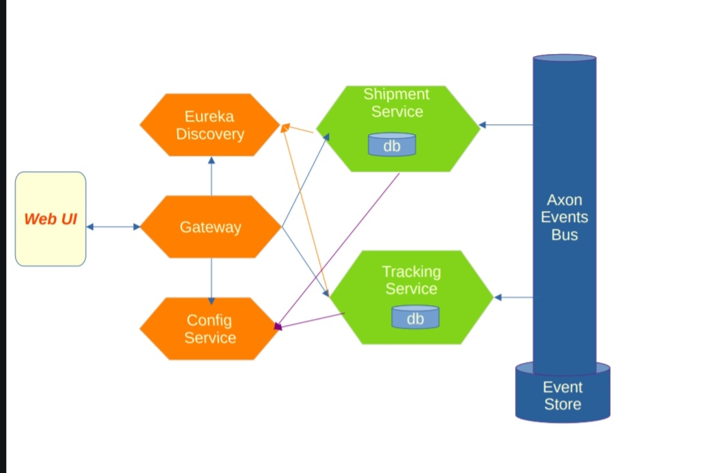
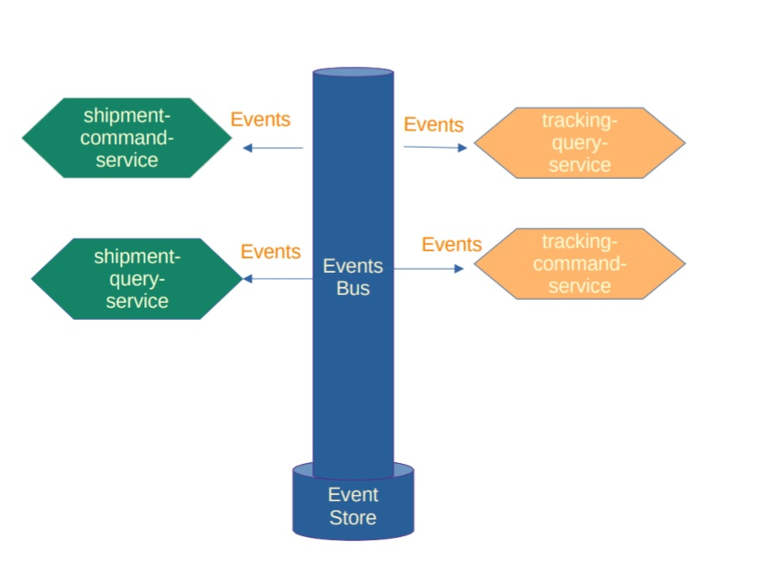
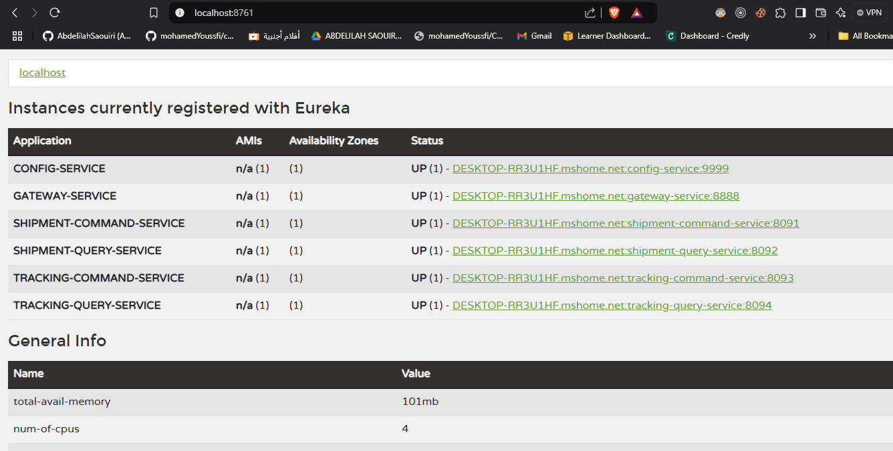
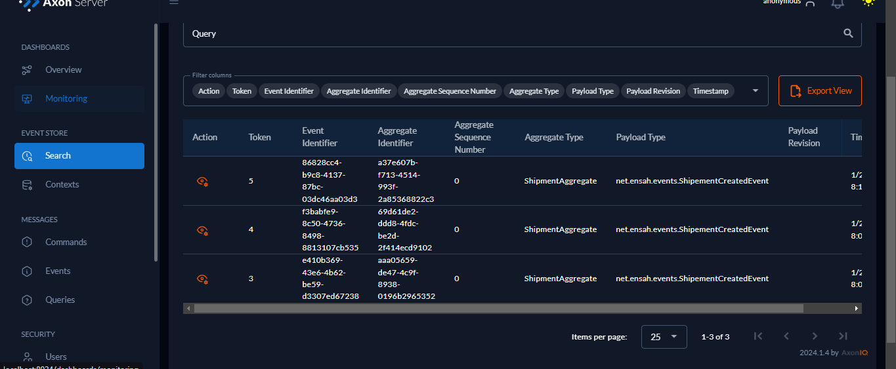
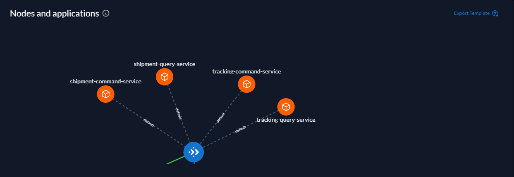
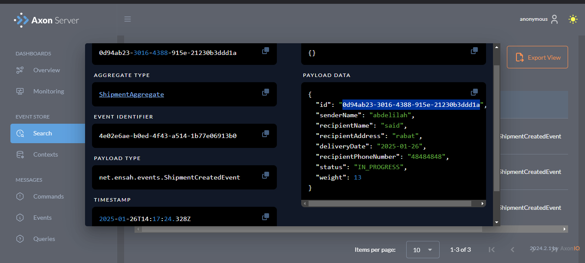
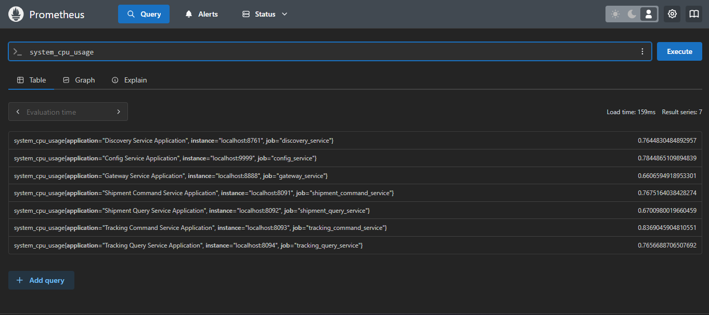
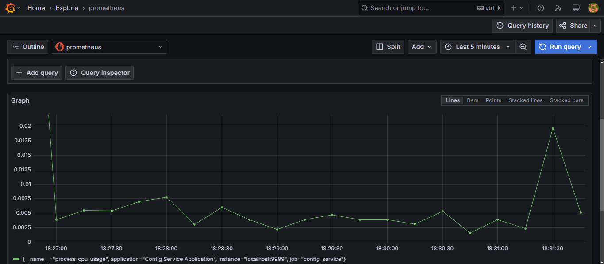
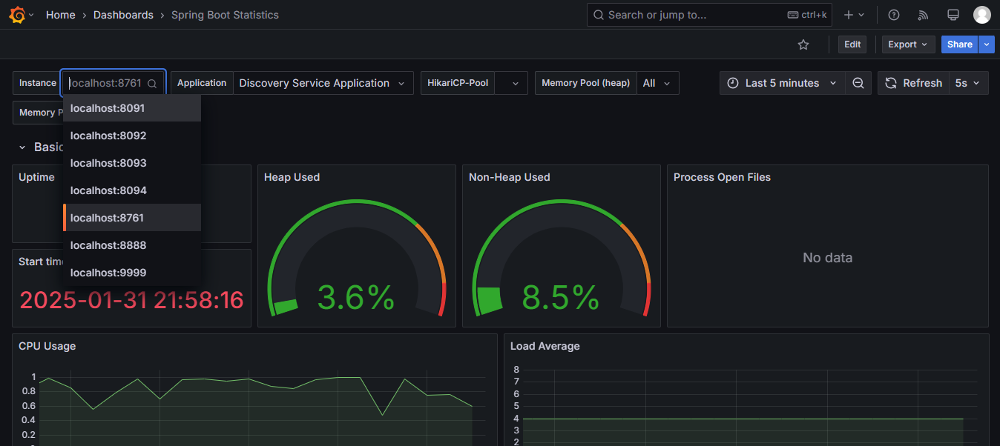

# 📦 ParcelTrack: Delivery Tracking System Based on CQRS and Event Sourcing

## 📌 Introduction 

**ParcelTrack** is a **delivery tracking platform** based on **CQRS (Command Query Responsibility Segregation)** and **Event Sourcing** principles.  
It follows an **event-driven microservices architecture** using **Axon Framework**, ensuring optimal **scalability, traceability, and consistency**.

The system consists of **multiple microservices**:

- **🚚 Shipment Service**: Handles shipment registration and generates delivery events.
- **📍 Tracking Service**: Queries parcel status in real-time and updates delivery projections.
- **🛠️ Config Service**: Centralized configuration management.
- **🧭 Discovery Service**: Service registry for microservices.
- **🌍 Gateway Service**: API gateway to route requests.

---

## 🏗️ Project Architecture

## 🚀 Technologies Used

- **Spring Boot** - Main framework  
- **Axon Framework** - Handles commands, events, and projections
- **Grafana & Prometheus** - Monitoring and observability  

## 📦 Microservices

### 1️⃣ Shipment Service (Expedition Service)
This microservice manages the **registration and tracking of shipments**.

### 🛠️ Features:
- Receives **commands** to create and update shipments.
- Generates **events** to notify status changes.
- Stores events via **Axon Server**.  

### 2️⃣ Tracking Service (Shipment Tracking)
This microservice is responsible for reading data and updating projections.

### 🛠️ Features:
- Listens to Shipment Service events .
- archive shipment status
- Exposes a REST API to query shipment status.

## 📊 Monitoring & Observability

The application integrates **Grafana** and **Prometheus** to monitor events and queries.

